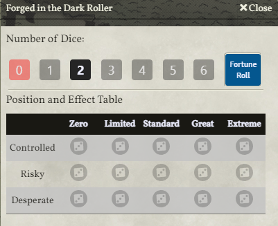

# Forged in the Dark Roller

A generic dice roller for Forged in the Dark games in FoundryVTT, based on code by Megastruktur

## Usage

Use the FD icon at the bottom of the taskbar. 
Pick your dice pool, position, and effect, then roll. 

OR

Use the shortcut key to bring up the dialog, set to 'R' by default.

## Settings

There are module settings for controlling: 
- the max number of dice 
- the default number of dice initially selected 
- the default position initially selected 
- the default effect initially selected 
- the new GUI interface (per user setting) 

## Macro usage

You can now set up macros and skip the popup UI altogether (Thanks to Thune#3566 for this idea and the idea for the entire module!) 

`game.fitdroller.FitDRoller("attribute", dice, "position", "effect") `

`attribute` = can be any string (defaults to "") 
`dice` = total number of dice to roll (defaults to 0) 
`position` = either controlled, risky, or desperate (defaults to risky if you enter anything else) 
`effect` = either great, standard, or limited (defaults to standard if you enter anything else) 

If you want to make a Fortune roll (no position or effect), set the `attribute` to fortune.

You can also trigger the Dialog using `game.fitdroller.FitDRollerPopup()`

## New GUI

A new GUI has been contributed by Mestre Digital and Gus, allowing for rolls with fewer clicks. 

Select your number of dice, then click the Fortune Roll button or the dice icon at the intersection of your desired Position and Effect

Based on concepts from Blades in the Dark (found at http://www.bladesinthedark.com/), product of One Seven Design, developed and authored by John Harper, and licensed for use under the Creative Commons Attribution 3.0 Unported license (http://creativecommons.org/licenses/by/3.0/).
